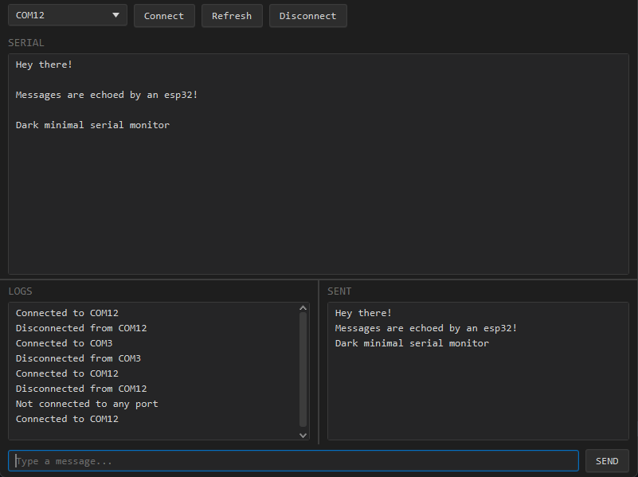

# Java Serial Monitor

A lightweight JavaFX desktop application for serial port communication.



---

## Features

- Serial port detection and connection
- Send text messages over UART
- Real time display of received data
- Separate panels for serial output, sent messages and logs
- Dark minimal UI

---

## Getting Started

### Download
Download the latest installer from [Releases](../../releases) — no Java required.

### Run from source

**Requirements:** JDK 21+, Maven 3.9+
```bash
mvn javafx:run
```

---

## Build

**Requirements:** JDK 21+, Maven 3.9+, WiX Toolset

To rebuild after making changes:
```bash
./rebuild.sh
```

---

## Dependencies

| Library | Version |
|---------|---------|
| [JavaFX](https://openjfx.io) | 21 |
| [jSerialComm](https://fazecast.github.io/jSerialComm) | 2.10.4 |
| [WiX Toolset](https://wixtoolset.org) | 3.x |

---

## License

MIT